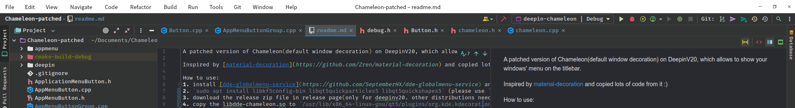

A patched version of Chameleon(default window decoration) on DeepinV20, which allows to show your windows' menu on the titlebar.

Inspired by [material-decoration](https://github.com/Zren/material-decoration) and copied lots of code from it :)

> there are bugs if you don't use the screen scale factor 1

How to use:
1. install [dde-globalmenu-service](https://github.com/SeptemberHX/dde-globalmenu-service) and set it with autostart(right click on the launcher)
2. `sudo apt install libkf5config-bin libqt5quickparticles5 libqt5quickshapes5` (please use `ldd` to check the dependencies)
3. download the release zip file in release page(only for deepinv20. other distributions need to compile from source)
4. copy the libdde-chameleon.so to `/usr/lib/x86_64-linux-gnu/qt5/plugins/org.kde.kdecoration2`(you should backup the one provided by the system)

How to restore if something wrong happens:
1. press ctrl+alt+F2 and login your account
2. copy raw *.so back or `sudo apt reinstall dde-kwin`